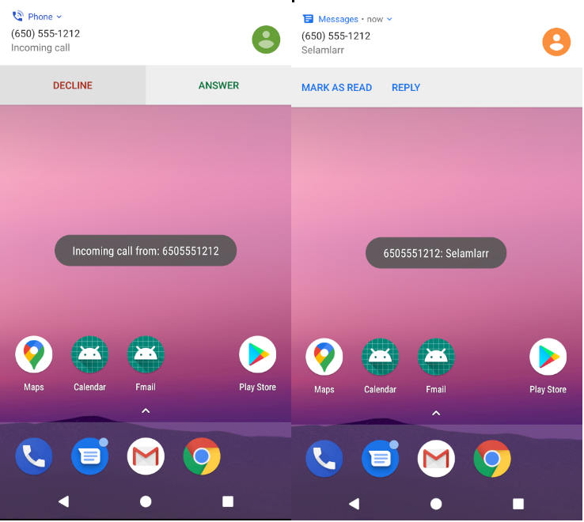
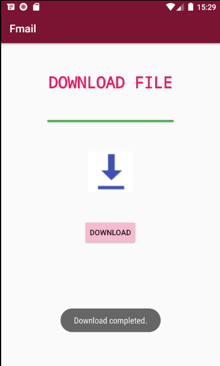
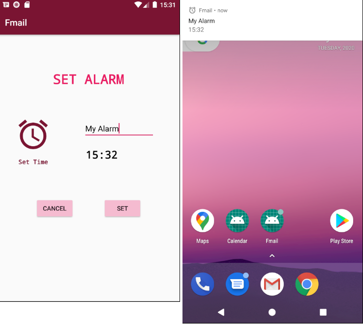
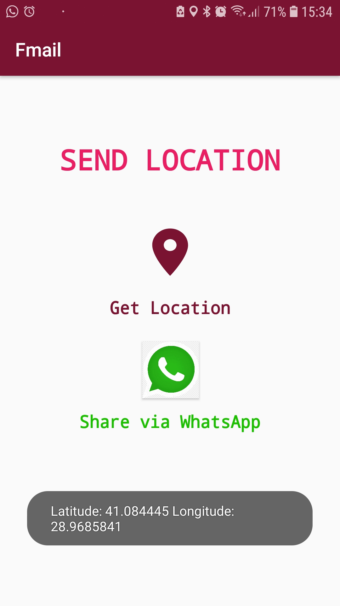

# Introduction to Mobile Programming Assignment 2

## Ödev 3 için Video Linki

## Ödev 3 için Eklenen Kısımlar

1. Gelen Arama ve Mesajları Log'lamak
Bu kısım için bir aktivite oluşturulmamıştır. Sadece gelen arama ve SMS'ler loglanmaktadır. Giden arama ve SMS'ler için işlem yapılmamaktadır.

Gelen Arama ve SMS:

  

2. AsyncTask'lar kullanılarak Progress Bar Üzerinden Hayali İndirme Yapma
AsycnTask ile random sayı üretilmitir. Üretilen bu sayılar Progress Bar'a eklenmektedir ve yüzde dolunca ses çalarak görüntü gösterilmektedir.

  

3. Alarm Oluşturma ve İptal Etme
TimePicker ile saat seçilmektedir. BroadcastReceiver ile seçilen bu saatte AlarmManager kullanılarak Vibration ve ses ile Notification gönderilmektedir. Oluşturulan alarm iptal edilebilmektedir.

  

4. Son Konumu Alma ve Whatsapp Aracılığıyla Gönderme
Cihazın son konumu FusedLocationProviderClient üzerinden çekilmektedir. Latitude ve longitude değerlerinden bir maps linki oluşturulmakta ve bu link Whatsapp aracılığıyla gönderilmektedir.

.

